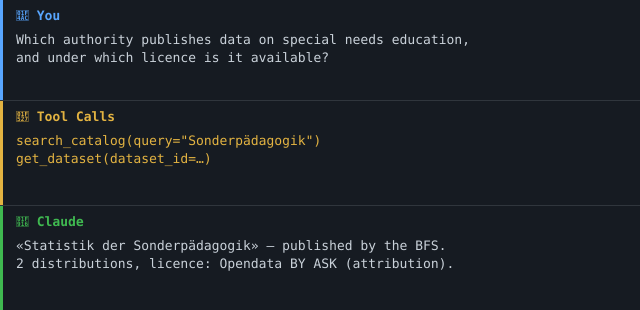

> **Teil des [Swiss Public Data MCP Portfolios](https://github.com/malkreide/swiss-public-data-mcp)** — einer Sammlung quelloffener MCP-Server, die KI-Agenten mit Schweizer öffentlichen und offenen Daten verbinden.
> Dies ist ein privates Projekt. Es steht in keiner Verbindung zu einem Arbeitgeber oder einer Behörde und wird nicht in deren Auftrag betrieben.

# i14y-mcp

[](LICENSE)
[](https://www.python.org/)
[](https://modelcontextprotocol.io/)
[](https://www.i14y.admin.ch)

**MCP-Server für die Interoperabilitätsplattform I14Y — den nationalen Metadatenkatalog der Schweiz.**

🇬🇧 [English version](README.md)

---

## Wozu dieser Server

Die übrigen Server dieses Portfolios beantworten die Frage *«Was sagen die
Daten?»*. Dieser hier beantwortet die Frage, die davor kommt: **«Wer publiziert
zu diesem Thema Daten, über welche Schnittstelle, und unter welcher Lizenz?»**

I14Y ist der nationale Datenkatalog, betrieben vom Bundesamt für Statistik. Er
beschreibt Datensätze, registrierte Schnittstellen, öffentliche Dienstleistungen
und harmonisierte Konzepte von Bund, Kantonen und Gemeinden nach dem
DCAT-AP-CH-Profil (eCH-0200).

> **Eselsbrücke: «Erst der Katalog, dann das Regal.»** Ohne Katalog muss ein
> Agent bereits wissen, dass eine Datenquelle existiert. Mit Katalog findet er sie.

---

## 🎯 Anchor Demo Query

> *«Welche Behörde publiziert Daten zur Sonderpädagogik, über welche
> Schnittstelle sind sie abrufbar, und unter welcher Lizenz?»*

```
search_catalog(query="Sonderpädagogik")
  → «Statistik der Sonderpädagogik» — Bundesamt für Statistik (BFS), Thema: Bildung

get_dataset(dataset_id=...)
  → 2 Distributionen, Lizenz: «Opendata BY ASK — Quellenangabe ist Pflicht,
    kommerzielle Nutzung nur mit Bewilligung des Datenlieferanten»
  → Kontakt: auskunftsdienst@bfs.admin.ch
```

Zwei Tool-Aufrufe verwandeln ein vages Thema in eine benannte Behörde, eine
Download-URL und eine handlungsrelevante Lizenz — `get_dataset` aggregiert
Distributionen, Lizenzen und Kontaktstelle in einem Datensatz.

### Demo



---

## Architektur

```
                 ┌──────────────────────────────┐
                 │      MCP Host (Claude)       │
                 └───────────────┬──────────────┘
                                 │ stdio | streamable-http
                 ┌───────────────▼──────────────┐
                 │          i14y-mcp            │
                 │  ┌────────────────────────┐  │
                 │  │ server.py  (13 Tools)  │  │
                 │  ├────────────────────────┤  │
                 │  │ mappers.py             │  │  DCAT → flach, eine Sprache
                 │  ├────────────────────────┤  │
                 │  │ models.py  (Pydantic)  │  │  source-/provenance-Envelope
                 │  ├────────────────────────┤  │
                 │  │ client.py              │  │  Retry 2s/4s/8s, 4xx ohne Retry
                 │  └────────────────────────┘  │
                 └───────────────┬──────────────┘
                                 │ HTTPS, ohne Auth
                 ┌───────────────▼──────────────┐
                 │  api.i14y.admin.ch/api       │
                 │  datasets · dataservices ·   │
                 │  concepts · publicservices · │
                 │  catalogs · agents · search  │
                 └──────────────────────────────┘
```

### Architektur-Entscheid

Dieser Server verwendet **Architektur A (nur Live-API)**.

Begründung (live verifiziert am 21. Juli 2026):
- Alle lesenden Endpunkte antworten ohne Authentifizierung und paginieren korrekt.
- Ein Bulk-Download der Katalogmetadaten wird nicht angeboten und ist nicht nötig.
- Fehlerantworten folgen RFC 7807, Fehlerzustände sind damit unterscheidbar.

Konsequenzen:
- Jeder HTTP-Aufruf wiederholt transiente Fehler mit 2 s / 4 s / 8 s Backoff.
- `search_catalog` deckelt clientseitig, weil die Quelle Paginierung ignoriert.
- `api_status` liefert immer einen auswertbaren Zustand statt leerer Records.

Vollständiger Probe-Report: [`docs/probe-i14y.md`](docs/probe-i14y.md).

### Projektphase

Dieser Server ist in **Phase 1 (read-only)** der «Read-only First»-Phasen­architektur
des Portfolios: alle Tools sind lesend, es gibt keine Authentifizierung und keine
Personendaten. Siehe [`docs/roadmap.md`](docs/roadmap.md) für das Phasenmodell und
die Voraussetzungen für eine allfällige spätere Schreibfähigkeit.

---

## Tools

| Tool | Zweck |
|---|---|
| `search_catalog` | Volltextsuche über den Katalog. Einstiegspunkt. |
| `list_datasets` | Paginiertes Datensatz-Register (vollständig, anders als die Suche). |
| `get_dataset` | Vollständiger Metadatensatz zu einem Datensatz. |
| `get_dataset_distributions` | Download-URLs, Formate und **Lizenzen**. |
| `list_data_services` | Register amtlicher Schnittstellen mit Endpunkt-URLs. |
| `get_data_service` | Vollständiger Datensatz zu einer Schnittstelle. |
| `list_public_services` | Öffentliche Dienstleistungen für Bürgerinnen und Bürger. |
| `list_concepts` | Harmonisierte Konzepte und Codelisten. |
| `get_concept` | Eine Konzeptdefinition. |
| `search_codelist_entries` | Einzelne Codes einer Codeliste. |
| `list_publishers` | Publizierende Stellen, inklusive UID. |
| `list_catalogs` | Beitragende Kataloge. |
| `api_status` | Erreichbarkeitsprüfung mit Graceful Degradation. |

Alle Tools sind mit `readOnlyHint: true` annotiert. Schreibende Operationen
existieren in der Quell-API, werden hier aber bewusst nicht exponiert.

### MCP-Primitive

Dieser Server exponiert **ausschliesslich Tools** — keine Resources, keine
Prompts. Das ist eine bewusste Entscheidung, kein Versäumnis: I14Y wird per
Volltextsuche und über opake UUIDs abgefragt, es gibt also keinen kleinen,
stabilen Satz adressierbarer URIs, der sich sauberer auf MCP-Resources abbilden
liesse; und der Server liefert keine vorgefertigten Prompt-Templates. Alle Tools
sind read-only und idempotent; entsteht künftig ein stabiler Einstiegspunkt (z. B.
eine feste Themenliste), ist er ein Kandidat für eine Resource.

### MCP-Protokoll-Version

Dieser Server bedient **zwei Protokoll-Aeren** ueber denselben Endpunkt. Die
erste Anfrage einer Verbindung entscheidet, welche gilt; ein spaeterer Anspruch
aus der jeweils anderen Aera wird abgewiesen.

| Aera | Revision | Wer sie erreicht |
|---|---|---|
| `initialize`-Handshake | `2024-11-05` … **`2025-11-25`** | Was heutige Clients sprechen. Der Server antwortet mit der angefragten Revision — oder mit der Obergrenze `2025-11-25`, wenn die Anfrage etwas Neueres verlangt. |
| Pro-Request-Envelope | **`2026-07-28`** | Eine Anfrage mit dem `2026-07-28`-`_meta`-Envelope oeffnet eine moderne Verbindung. |

Beide Revisionen sind in
[`tests/test_protocol_version.py`](tests/test_protocol_version.py) gepinnt und
werden gegen das installierte SDK geprueft; ein Dependabot-Bump von `mcp` kann
also keine der beiden still verschieben. Die Handshake-Obergrenze wird an einem echten `initialize` durch den
zusammengebauten ASGI-Stack gemessen, nicht aus einem Konstantennamen
abgelesen.

Zu beachten: `LATEST_PROTOCOL_VERSION` im SDK ist ein Alias auf die **moderne**
Aera, nicht auf die Handshake-Aera — wer nur dagegen pinnt, laesst genau die
Aera frei wandern, die heutige Clients tatsaechlich aushandeln.

### Was der Server auf der modernen Revision traegt

`2026-07-28` loest die Erkennung vom `initialize`-Handshake und legt sie auf
`server/discover` plus einen Envelope pro Anfrage; jedes cachebare Resultat
traegt zusaetzlich einen Frischehinweis. Was dieser Server auf diese Flaechen
schreibt, ist in
[`tests/test_spec_2026_07_28.py`](tests/test_spec_2026_07_28.py) gemessen — durch
den zusammengebauten Stack und, fuer stdio, durch einen echten Unterprozess —
statt aus der Konfiguration zurueckgelesen:

| Flaeche | Was dieser Server antwortet |
|---|---|
| `serverInfo`, gestempelt unter **jede** moderne Antwort | Name, Anzeigename, Beschreibung, Website und die installierte Paketversion — dieselbe Version, die auch der ausgehende `User-Agent` traegt |
| `server/discover` → `instructions` | in welcher Reihenfolge die Werkzeuge greifen, plus die zwei Eigenheiten von I14Y, die aus keiner einzelnen Tool-Beschreibung hervorgehen |
| `ttlMs` / `cacheScope` | 300 s, `public`, auf allen fuenf cachebaren Methoden, die dieser Server beantwortet |
| `tools[].title` | ein Anzeigename je Werkzeug, damit ein Client «Search a concept's code list» zeigt und nicht `search_codelist_entries` |

Der Frischehinweis ist nicht kosmetisch: ohne ihn antwortet das SDK mit
`ttlMs: 0, cacheScope: private` — «schon veraltet, nie teilen» — fuer
Verzeichnisse, die beim Import feststehen und sich bis zum Prozessende nicht
aendern koennen.

Beide Transporte bedienen die moderne Revision: HTTP ueber den
Streamable-HTTP-Session-Manager, stdio — die Vorgabe, und was `uvx i14y-mcp`
startet — ueber dieselbe Dual-Aera-Schleife. Der eine belegt fuer den anderen
nichts, deshalb sind beide gemessen.

**Eine Ankuendigung, die dieser Server nicht einloest.** Auf `2026-07-28`
leiten sich die `listChanged`-Flags und `resources.subscribe` ausschliesslich
daraus ab, ob `subscriptions/listen` bedient wird — und das SDK verdrahtet den
Handler bedingungslos. `server/discover` meldet deshalb `listChanged: true` fuer
eine Werkzeugliste, die beim Import feststeht, und ein Abo ueber eine leere
Ressourcenliste; eine Aenderungsmeldung geht nie hinaus. Ueber die oeffentliche
Oberflaeche ist das nicht abstellbar — nur ein vollstaendig ersetzter
`server/discover`-Handler koennte es, und der waere eine zweite Wahrheit ueber
die eigenen Faehigkeiten. Deshalb per Test festgehalten statt uebertuencht.

**Update-Politik.** Faellt das Gate, die Konstante nicht blind nachziehen: erst
das Spec-Changelog zwischen den beiden Revisionen lesen, pruefen, ob sich der
Server weiterhin richtig verhaelt, dann Konstante, diesen Abschnitt, `README.md`
und [`CHANGELOG.md`](CHANGELOG.md) gemeinsam bewegen.

---

## Installation

```bash
uvx i14y-mcp
```

Oder aus dem Quellcode:

```bash
git clone https://github.com/malkreide/i14y-mcp
cd i14y-mcp
pip install -e ".[dev]"
```

### Claude Desktop

```json
{
  "mcpServers": {
    "i14y": {
      "command": "uvx",
      "args": ["i14y-mcp"]
    }
  }
}
```

### Remote-Betrieb (Render, Railway)

```bash
I14Y_MCP_TRANSPORT=streamable-http HOST=0.0.0.0 PORT=8000 i14y-mcp
```

`I14Y_MCP_TRANSPORT` akzeptiert `stdio` (der Standard des Einstiegspunkts
selbst), `streamable-http` (`http` ist ein Synonym) oder `sse`. Die
HTTP-Transporte binden an `HOST`, standardmässig `127.0.0.1` (Loopback); für ein
PaaS `HOST=0.0.0.0` setzen (das Container-Image tut beides bereits).

#### Connector-URL: `https://<host>/mcp`

Ein Claude.ai-Custom-Connector spricht Streamable HTTP, und dieser Transport
serviert genau einen Pfad: `/mcp`. `sse` ist der ältere Transport und serviert
stattdessen `/sse` und `/messages` — am zusammengebauten Stack gemessen
antwortet `POST /mcp` dort mit **404** und unter Streamable HTTP mit **200**.
Deshalb ist `streamable-http` die Vorgabe des Container-Images; ein Connector,
der auf ein SSE-Deployment zeigt, bekommt einen 404 und kommt nie zum Handshake.

#### `I14Y_MCP_ALLOWED_HOSTS` — für einen öffentlichen Betrieb nötig

Eine kommagetrennte Liste der Hostnamen, unter denen der Server erreicht wird —
**nur Hostnamen, ohne Schema und ohne Port**:

```bash
I14Y_MCP_ALLOWED_HOSTS=i14y-mcp.up.railway.app,mcp.example.ch
```

Der Wert wird literal mit dem eingehenden `Host`-Header verglichen. Ein
`https://i14y-mcp.up.railway.app` oder ein angehängtes `:443` trifft deshalb
nichts, und jede Anfrage scheitert mit **HTTP 421 Invalid Host header**. Hinter
TLS schickt der Browser den blossen Hostnamen; für einen abweichenden Port gibt
es im SDK genau eine Wildcard-Form, `host:*`. Loopback bleibt in jedem Fall
erreichbar, Container-Health-Checks sind also nicht betroffen.

Die Variable wegzulassen fällt bei einem Nicht-Loopback-Bind **nicht** auf etwas
Sicheres zurück. Der Server kann den Namen nicht erraten, unter dem er
angesprochen wird, und eine geratene Liste würde jede echte Anfrage abweisen —
also schaltet er die Host-Prüfung ganz ab und schreibt es ins Log:

```
dns_rebinding_protection_off
```

CORS exponiert den `Mcp-Session-Id`-Header, damit Browser-MCP-Clients ihre Session behalten.
Welche Browser-Origins den Server aufrufen dürfen, kommt aus
`I14Y_MCP_CORS_ORIGINS`, einer kommagetrennten Liste — **nicht gesetzt heisst:
kein Browser-Client wird zugelassen**, und das ist der Standard. `*` geht
weiterhin und schreibt eine Warnung ins Log. stdio und andere
Nicht-Browser-Clients sind davon unberührt.

### Docker

```bash
docker compose up --build      # Streamable HTTP auf http://localhost:8000/mcp
```

Das Image ist ein gehärteter Multi-Stage-Build: Es läuft als Nicht-Root-Benutzer,
enthält keine Build-Tools und benötigt keine Secrets (die API ist
unauthentifiziert). Siehe [`Dockerfile`](Dockerfile) und [`compose.yaml`](compose.yaml).

---

## Join Keys

I14Y ist eine Verbindungsschicht. Zwei Identifikatoren machen sie mit dem
übrigen Portfolio kombinierbar:

| Schlüssel | Feld | Verbindet zu |
|---|---|---|
| UID | `Publisher.uid` | [`register-mcp`](https://github.com/malkreide/register-mcp) (Zefix) |
| Endpunkt-URL | `DataServiceSummary.endpoint_urls` | jedem Portfolio-Server, der diese API kapselt |

---

## Bekannte Einschränkungen

Live verifiziert am 21. Juli 2026.

1. **Der Suchindex deckt rund die Hälfte des Registers ab.** `search_catalog`
   liefert maximal 1013 Records, `list_datasets` erreicht rund 2003. Wo
   Vollständigkeit zählt, ist `list_datasets` zu verwenden.
2. **Die Suche liefert ausschliesslich Datensätze.** Ein Filter
   `types=["Concept"]` oder `types=["DataService"]` ergibt null Treffer, obwohl
   diese Entitäten existieren. Stattdessen `list_concepts` und
   `list_data_services` verwenden.
3. **Die Quelle ignoriert Paginierung bei der Suche.** Es wird immer das
   vollständige Resultatset geliefert; dieser Server deckelt bei 200 Records
   und setzt `truncated: true`.
4. **Lizenzen gelten pro Distribution**, nicht pro Datensatz. Die meisten tragen
   «Opendata BY ASK» — Quellenangabe ist Pflicht, kommerzielle Nutzung nur mit
   Bewilligung. Vor jeder Weiterverwendung das Feld `licence` lesen.
5. **Manche Metadatenfelder sind schlicht leer.** Frequenz, zeitliche Abdeckung
   und Distributionsformat sind optional und werden von Publizierenden häufig
   nicht gesetzt. Das ist eine Datenqualitätseigenschaft des Katalogs, kein
   Fehler dieses Servers.
6. **Nicht jeder Eintrag mit Endpunkt hat eine URL.** Einträge, die nur mit
   «OpenAPI Spezifikation» ohne URI beschriftet sind, erscheinen als
   `(no URI) <Label>` statt zu verschwinden.

---

## Tests

```bash
PYTHONPATH=src pytest tests/ -m "not live"   # offline, in der CI verwendet
PYTHONPATH=src pytest tests/ -m "live"       # gegen die echte API
PYTHONPATH=src pytest tests/                 # alles
python -m ruff check src tests
```

Die Live-Tests sind kein Zierrat: Fundstück 4 im Probe-Report — Keywords, die
ihr Sprachobjekt unter `label` verschachteln — wurde von einem Live-Test
gefunden, nachdem die Unit-Tests bereits grün waren.

---

## Mitwirken

Siehe [`CONTRIBUTING.de.md`](CONTRIBUTING.de.md) für die Grundregeln (read-only,
ein Egress-Host, keine Secrets) und den lokalen Entwicklungs-Loop. Für
Maintainer beschreibt [`PUBLISHING.md`](PUBLISHING.md) den Release-Prozess für
PyPI und MCP-Registry.

---

## Sicherheit

Siehe [`SECURITY.de.md`](SECURITY.de.md) für die Sicherheits-Posture und die
Meldung von Schwachstellen.

---

## Lizenz

MIT-Lizenz — siehe [LICENSE](LICENSE). Die Katalogdaten unterliegen weiterhin den
Bedingungen der jeweiligen Publisher.

---

## Autor

**Hayal Oezkan** · [github.com/malkreide](https://github.com/malkreide)

---

## Credits & verwandte Projekte

- Daten: [Interoperabilitätsplattform I14Y](https://www.i14y.admin.ch), Bundesamt für Statistik (BFS)
- Standard: [eCH-0200 / DCAT-AP-CH](https://www.ech.ch/de/ech/ech-0200/1.0)
- Quellenrecherche inspiriert von [rnckp/awesome-ogd-switzerland](https://github.com/rnckp/awesome-ogd-switzerland)
- Portfolio: [swiss-public-data-mcp](https://github.com/malkreide/swiss-public-data-mcp)
- Protokoll: [Model Context Protocol](https://modelcontextprotocol.io/)

Lizenz: MIT. Die Katalogdaten unterliegen weiterhin den Bedingungen der
jeweiligen Publizierenden.
